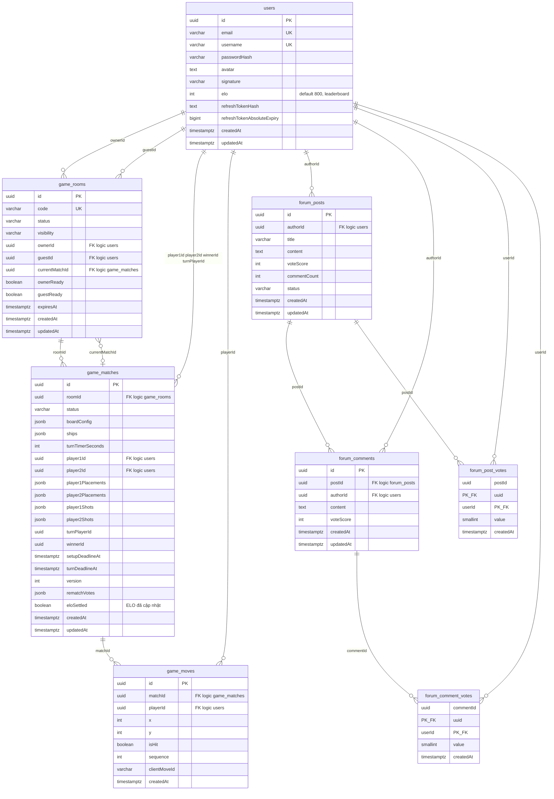

# ERD — Toàn bộ cơ sở dữ liệu (PostgreSQL)

## Phạm vi

Mô tả **tất cả bảng** mà backend TypeORM đang dùng: **auth / game online / forum**, gồm các chỉnh sửa gần đây (**`users.elo`**, **`game_matches.eloSettled`** cho xếp hạng ELO và leaderboard).

**Lưu ý kỹ thuật:** Trong mã nguồn **không khai báo `@ManyToOne` / FK constraint** trên Postgres; các cột `…Id` là **khóa ngoại logic** — toàn vẹn dữ liệu do tầng ứng dụng đảm bảo.

## Sơ đồ quan hệ (Mermaid)

## Bảng và migration nguồn

| Bảng (Postgres)        | Mục đích ngắn gọn                          | Migration / entity |
|------------------------|--------------------------------------------|--------------------|
| `users`                | Tài khoản, profile, session refresh, **ELO** | `1773446400000-InitUsersTable`, **`1773446400007`** (thêm `elo`) |
| `game_rooms`           | Phòng chờ / setup / trận                 | `1773446400001-InitGameTables` |
| `game_matches`         | Trận, JSON trạng thái bàn, **eloSettled**  | `1773446400001`, …, **`1773446400007`** |
| `game_moves`           | Lịch sử nước đi (audit)                    | `1773446400001` |
| `forum_posts`          | Bài viết forum                             | `1773446400006-InitForumTables` |
| `forum_comments`       | Bình luận                                  | `1773446400006` |
| `forum_post_votes`     | Vote bài (composite PK postId + userId)    | `1773446400006` |
| `forum_comment_votes`  | Vote comment                               | `1773446400006` |

Các migration bổ sung timer/setup: `1773446400002` … `1773446400005` (cột deadline / timer trên `game_matches`), không tạo bảng mới.

## Cột liên quan ELO / leaderboard (cập nhật ERD)

- **`users.elo`** (`integer`, mặc định **800**): điểm xếp hạng; dùng cho API leaderboard và auth payload.
- **`game_matches.eloSettled`** (`boolean`, mặc định **false**): đánh dấu đã áp dụng công thức Elo cho trận kết thúc (tránh xử lý trùng).

**Rank tier** (Apprentice … Ocean Conqueror) **không lưu DB** — suy ra từ `elo` trên server/client.

## Nguồn mã (entity TypeORM)

- `server/src/auth/infrastructure/persistence/relational/entities/user.entity.ts`
- `server/src/game/infrastructure/persistence/relational/entities/room.entity.ts`
- `server/src/game/infrastructure/persistence/relational/entities/match.entity.ts`
- `server/src/game/infrastructure/persistence/relational/entities/move.entity.ts`
- `server/src/forum/infrastructure/persistence/relational/entities/forum-post.entity.ts`
- `server/src/forum/infrastructure/persistence/relational/entities/forum-comment.entity.ts`
- `server/src/forum/infrastructure/persistence/relational/entities/forum-post-vote.entity.ts`
- `server/src/forum/infrastructure/persistence/relational/entities/forum-comment-vote.entity.ts`

## Giả định và giới hạn

- Một `game_room` có thể có **nhiều** `game_matches` theo thời gian (rematch); `currentMatchId` trỏ tới trận hiện tại khi có.
- Bảng `migrations` do TypeORM quản lý, không vẽ trong ERD nghiệp vụ.
- File upload avatar lưu trên đĩa (`uploads/`), URL tham chiếu trong `users.avatar`.

## Liên kết ERD theo domain (cũ, chi tiết từng phần)

- Online match + moves: `.docs/07-online-match-lifecycle/10-erd.md`
- Các domain khác: `.docs/*/10-erd.md` (phạm vi hẹp hơn tài liệu này).
