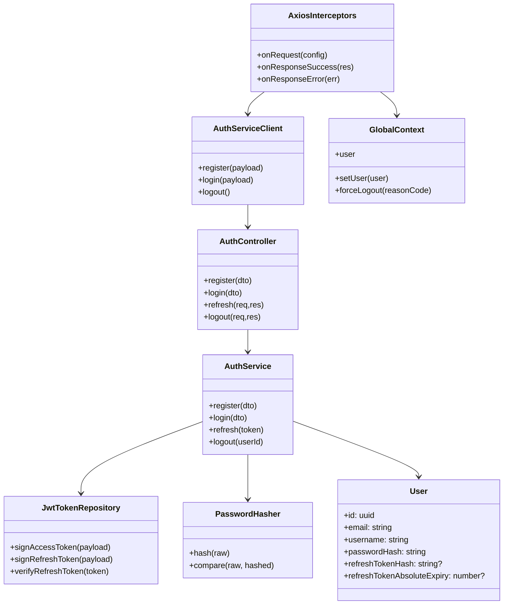

# Class Diagram - Auth va Session

## Pham vi
Mo ta cac lop va quan he chinh cho dang ky, dang nhap, refresh token, logout va force logout o client.

## Mermaid

## Nguon ma lien quan
- client/src/services/authService.ts
- client/src/services/interceptors.ts
- client/src/store/globalContext.tsx
- server/src/auth/auth.controller.ts
- server/src/auth/auth.service.ts
- server/src/auth/jwt.strategy.ts
- server/src/auth/infrastructure/persistence/relational/entities/user.entity.ts
