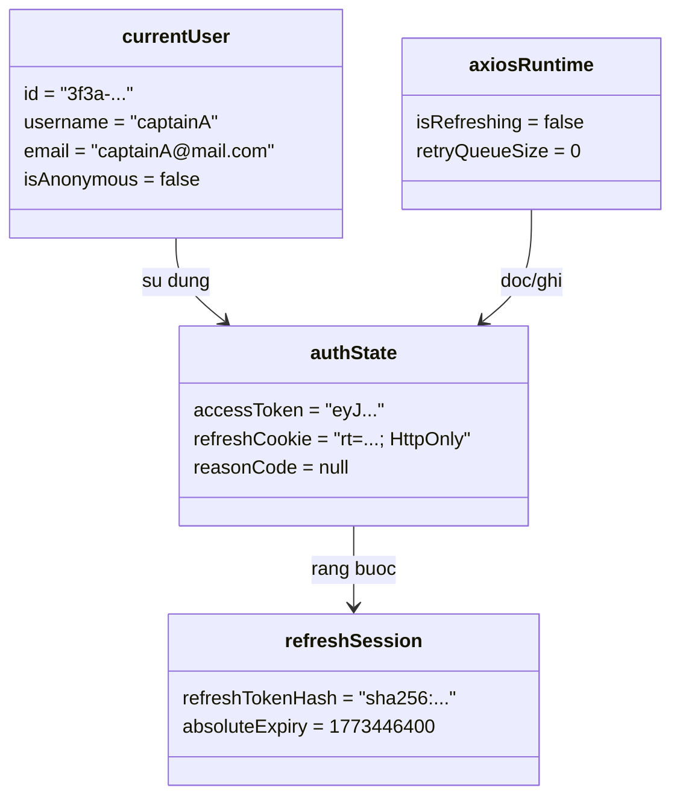

# Object Diagram - Auth va Session

## Pham vi
Anh xa doi tuong thuc te tai thoi diem nguoi dung vua dang nhap thanh cong va he thong dang giu refresh token hop le.

## Mermaid

## Nguon ma lien quan
- client/src/store/globalContext.tsx
- client/src/services/interceptors.ts
- server/src/auth/auth.service.ts
- server/src/auth/infrastructure/persistence/relational/entities/user.entity.ts
