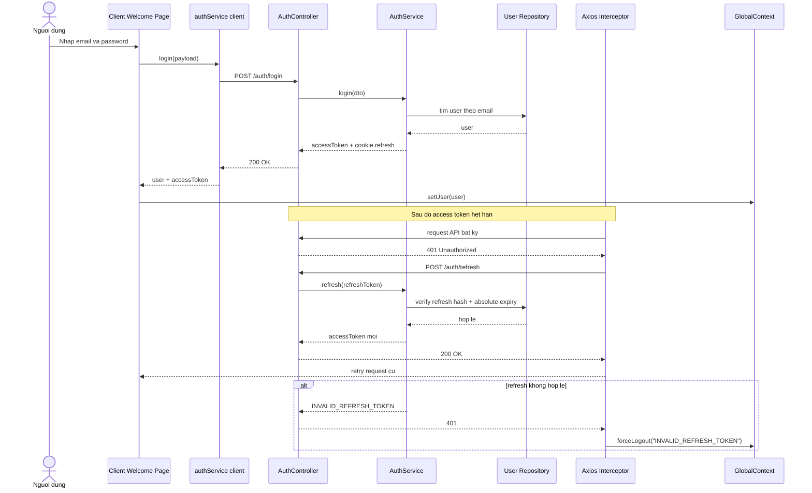

# Sequence Diagram - Dang nhap va Refresh

## Pham vi
Luong thoi gian tu login den refresh token khi access token het han.

## Mermaid

## Nguon ma lien quan
- client/src/pages/welcome.tsx
- client/src/services/authService.ts
- client/src/services/interceptors.ts
- client/src/store/globalContext.tsx
- server/src/auth/auth.controller.ts
- server/src/auth/auth.service.ts
