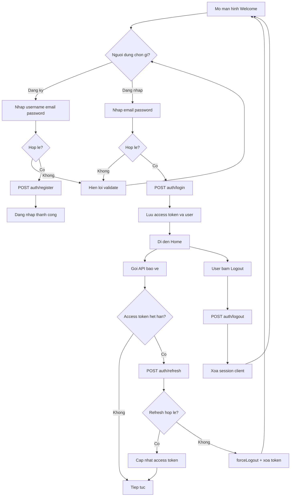

# Activity Diagram - Auth va Session

## Pham vi
Mo ta workflow dang ky, dang nhap, refresh va logout.

## Mermaid

## Nguon ma lien quan
- client/src/pages/welcome.tsx
- client/src/services/interceptors.ts
- client/src/services/authService.ts
- server/src/auth/auth.controller.ts
