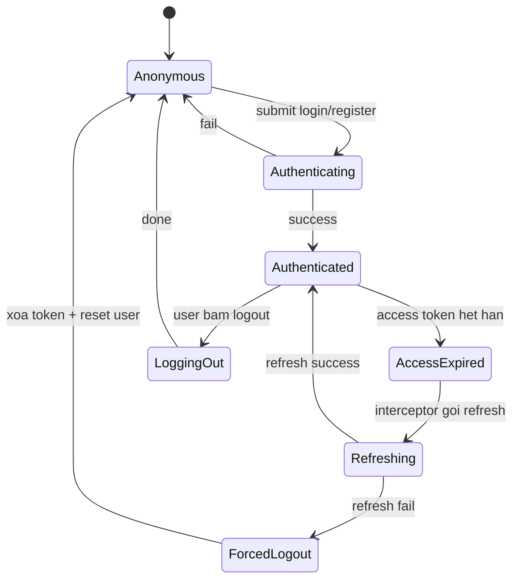

# State Diagram - Session Token

## Pham vi
Mo ta may trang thai session o client va server.

## Mermaid

## Nguon ma lien quan
- client/src/services/interceptors.ts
- client/src/store/globalContext.tsx
- server/src/auth/auth.service.ts
