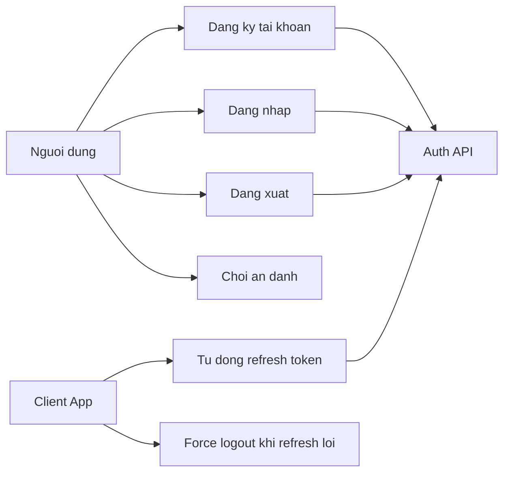

# Use Case Diagram - Auth va Session

## Pham vi
Tac nhan va use case chinh lien quan den xac thuc nguoi dung.

## Mermaid

## Nguon ma lien quan
- client/src/pages/welcome.tsx
- client/src/services/authService.ts
- client/src/services/interceptors.ts
- server/src/auth/auth.controller.ts
