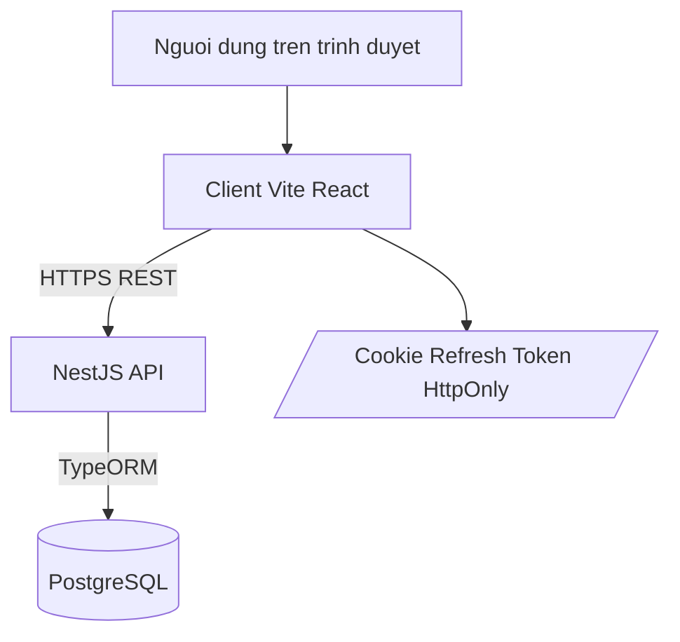

# Deployment Diagram - Auth va Session

## Pham vi
Topologi runtime cho auth bao gom browser, API va database.

## Mermaid

## Nguon ma lien quan
- docker-compose.yml
- docker-compose.prod.yml
- server/src/main.ts
- server/src/database/data-source.ts
