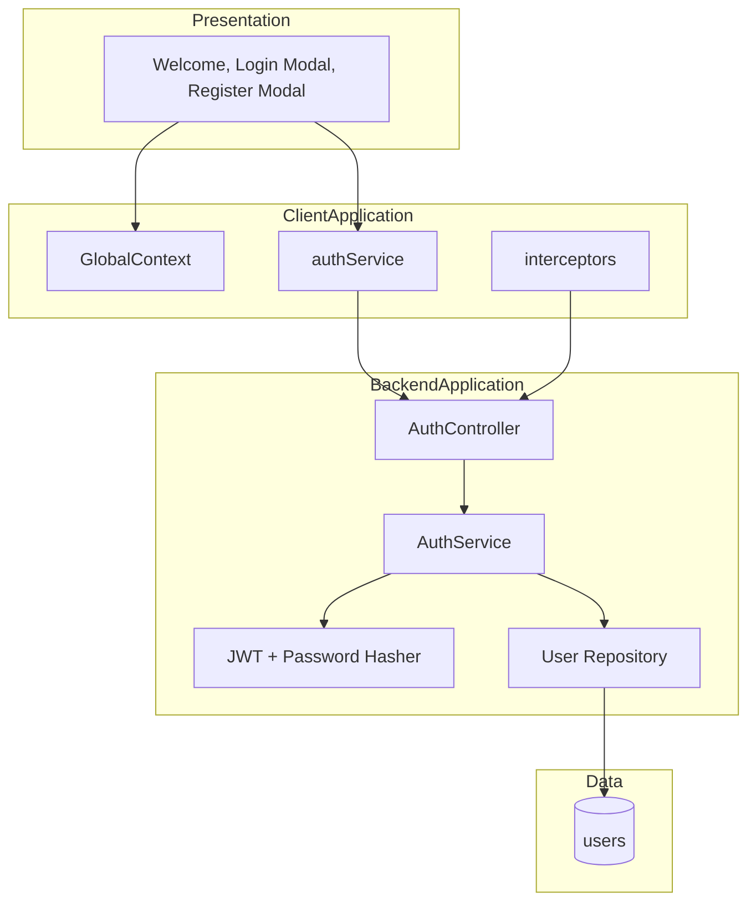

# Architecture Diagram - Auth va Session

## Pham vi
Goc nhin kien truc theo layer cho nhom tinh nang auth.

## Mermaid

## Nguon ma lien quan
- client/src/pages/welcome.tsx
- client/src/store/globalContext.tsx
- client/src/services/authService.ts
- client/src/services/interceptors.ts
- server/src/auth/auth.controller.ts
- server/src/auth/auth.service.ts
- server/src/auth/infrastructure/persistence/relational/entities/user.entity.ts
