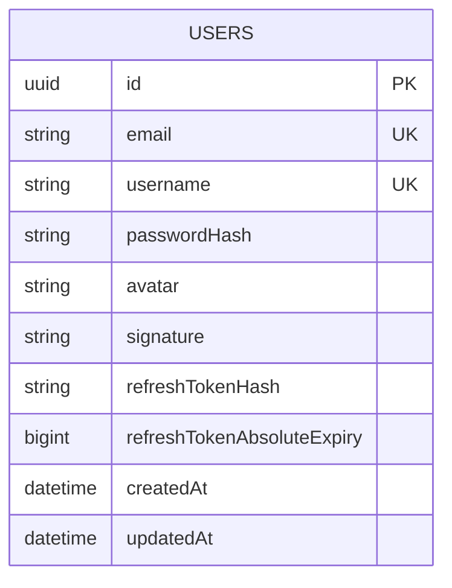

# ERD - Auth va Session

## Pham vi
Mo hinh du lieu bang users va cac truong phuc vu refresh session.

## Mermaid

## Quy tac nghiep vu
- email va username la duy nhat.
- refreshTokenHash duoc cap nhat moi lan refresh thanh cong.
- refreshTokenAbsoluteExpiry gioi han toi da chu ky song cua session.

## Nguon ma lien quan
- server/src/auth/infrastructure/persistence/relational/entities/user.entity.ts
- server/src/database/migrations/1773446400000-InitUsersTable.ts
- server/src/auth/auth.service.ts
