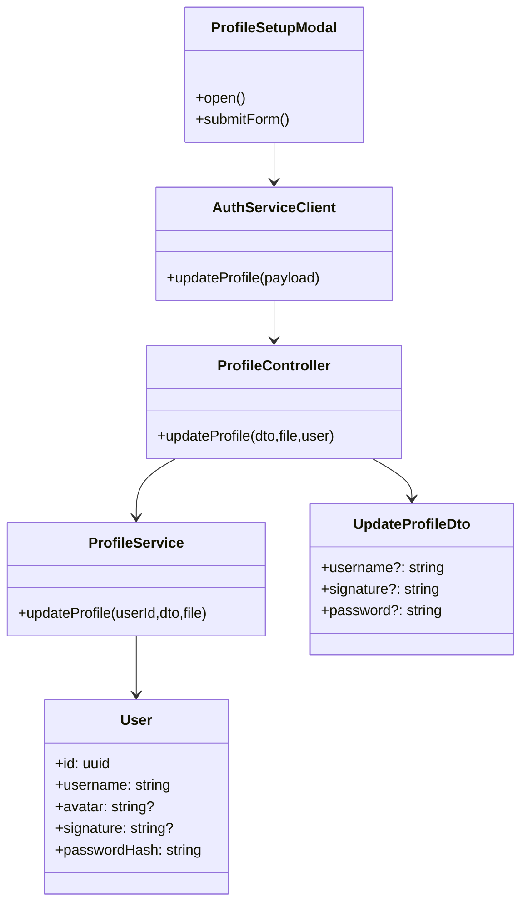

# Class Diagram - Profile

## Pham vi
Mo ta lop va quan he chinh cho cap nhat ho so, avatar va doi mat khau.

## Mermaid

## Nguon ma lien quan
- client/src/components/modal/ProfileSetupModal.tsx
- client/src/services/authService.ts
- server/src/profile/profile.controller.ts
- server/src/profile/profile.service.ts
- server/src/profile/dto/update-profile.dto.ts
- server/src/auth/infrastructure/persistence/relational/entities/user.entity.ts
