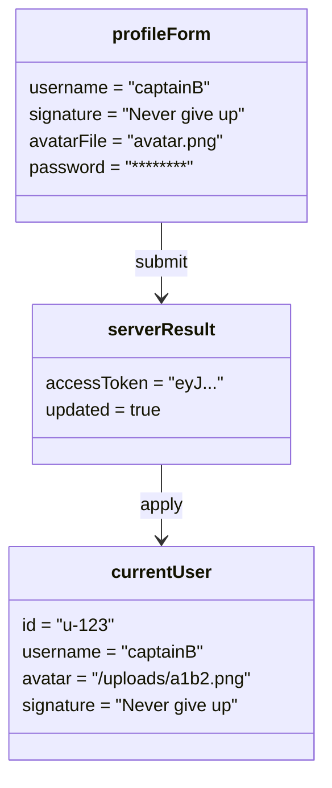

# Object Diagram - Profile

## Pham vi
Anh xa doi tuong tai thoi diem nguoi dung vua cap nhat profile thanh cong.

## Mermaid

## Nguon ma lien quan
- client/src/components/modal/ProfileSetupModal.tsx
- client/src/store/globalContext.tsx
- server/src/profile/profile.service.ts
