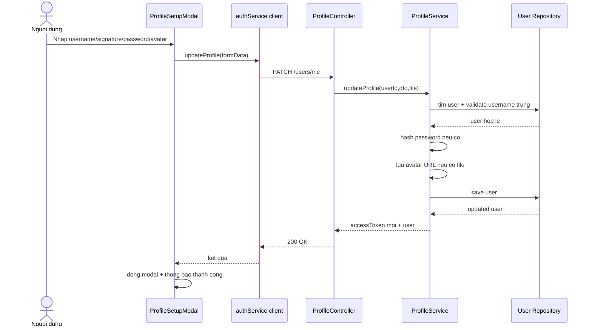

# Sequence Diagram - Profile Update

## Pham vi
Luong cap nhat profile tu UI den backend, bao gom avatar va password.

## Mermaid

## Nguon ma lien quan
- client/src/components/modal/ProfileSetupModal.tsx
- client/src/services/authService.ts
- server/src/profile/profile.controller.ts
- server/src/profile/profile.service.ts
