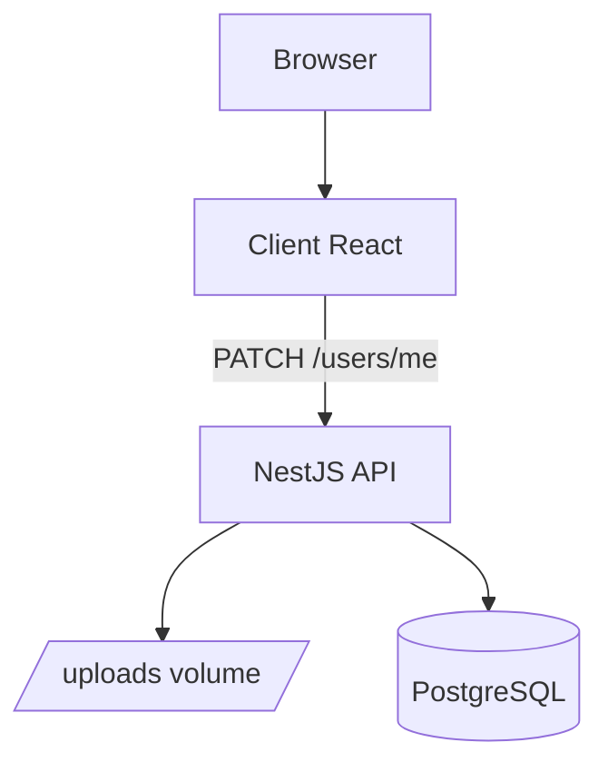

# Deployment Diagram - Profile

## Pham vi
Topologi runtime cho profile update va upload avatar.

## Mermaid

## Nguon ma lien quan
- docker-compose.yml
- server/src/profile/profile.controller.ts
- server/uploads
