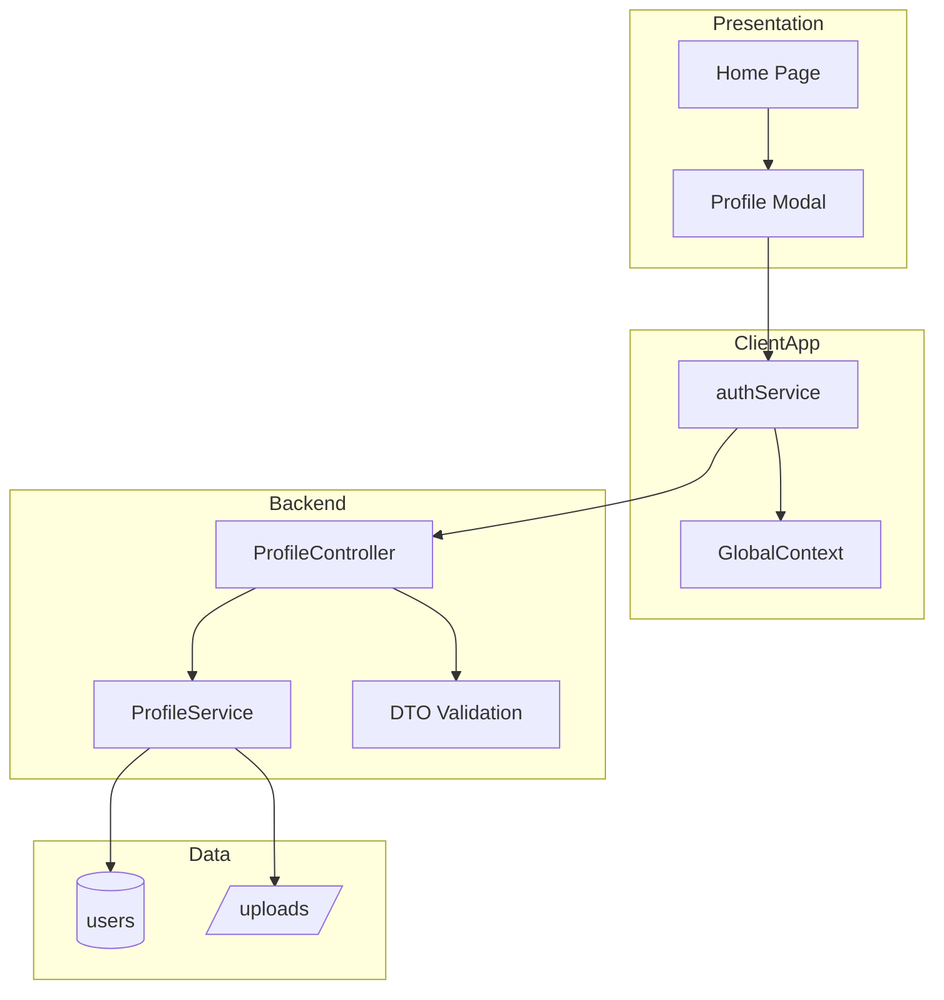

# Architecture Diagram - Profile

## Pham vi
Kien truc theo layer cua tinh nang profile.

## Mermaid

## Nguon ma lien quan
- client/src/pages/home.tsx
- client/src/components/modal/ProfileSetupModal.tsx
- client/src/services/authService.ts
- server/src/profile/profile.controller.ts
- server/src/profile/profile.service.ts
