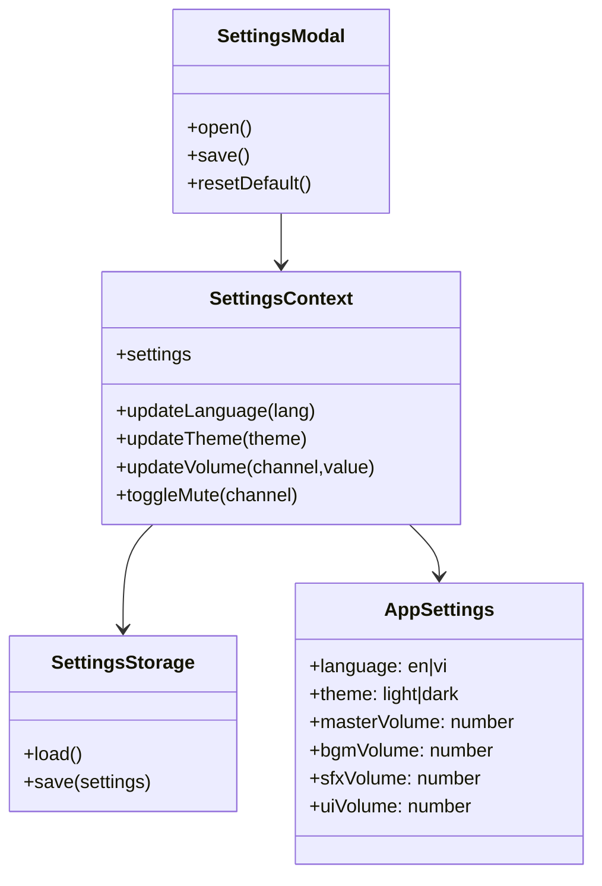

# Class Diagram - Settings

## Pham vi
Mo ta cac lop va quan he cho quan ly language, theme va volume.

## Mermaid

## Nguon ma lien quan
- client/src/components/modal/SettingsModal.tsx
- client/src/store/settingsContext.tsx
- client/src/hooks/useSettings.ts
- client/src/services/settingsStorage.ts
