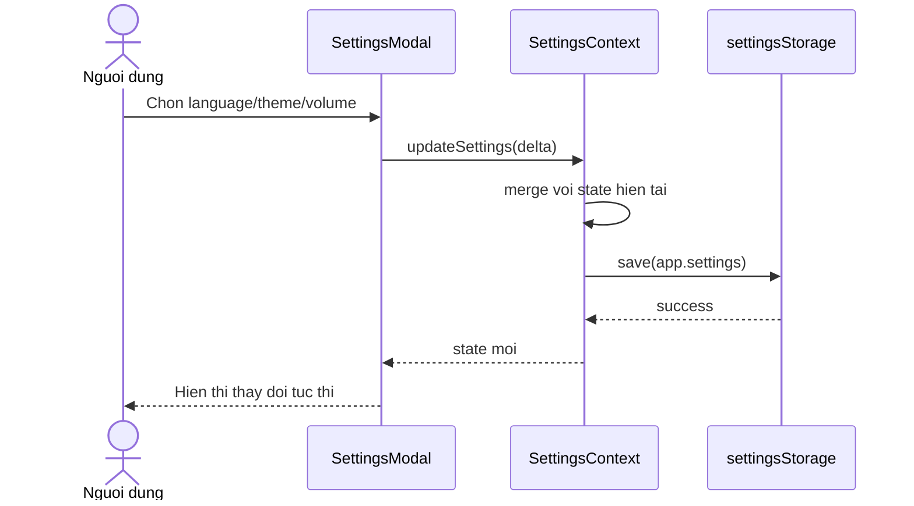

# Sequence Diagram - Cap nhat Settings

## Pham vi
Luong nguoi dung thay doi settings va luu local.

## Mermaid

## Nguon ma lien quan
- client/src/components/modal/SettingsModal.tsx
- client/src/store/settingsContext.tsx
- client/src/services/settingsStorage.ts
