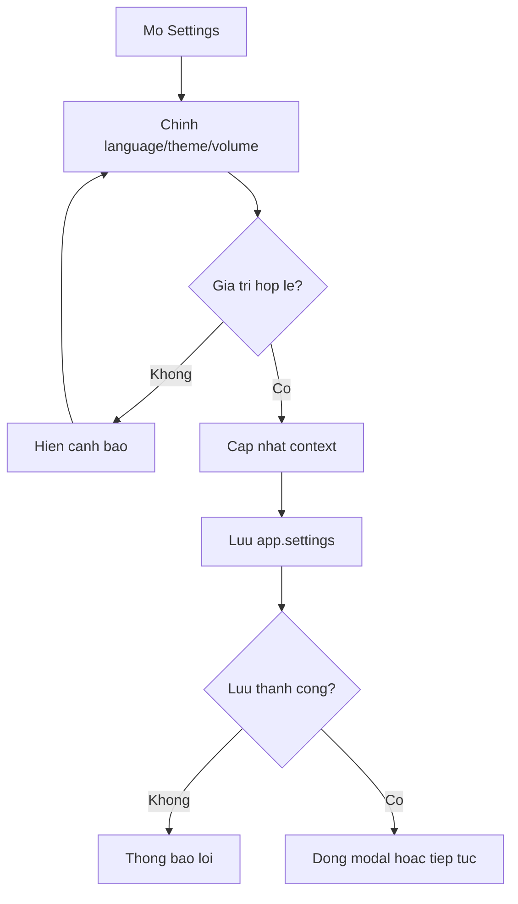

# Activity Diagram - Settings

## Pham vi
Workflow doi settings tu UI den localStorage.

## Mermaid

## Nguon ma lien quan
- client/src/components/modal/SettingsModal.tsx
- client/src/store/settingsContext.tsx
