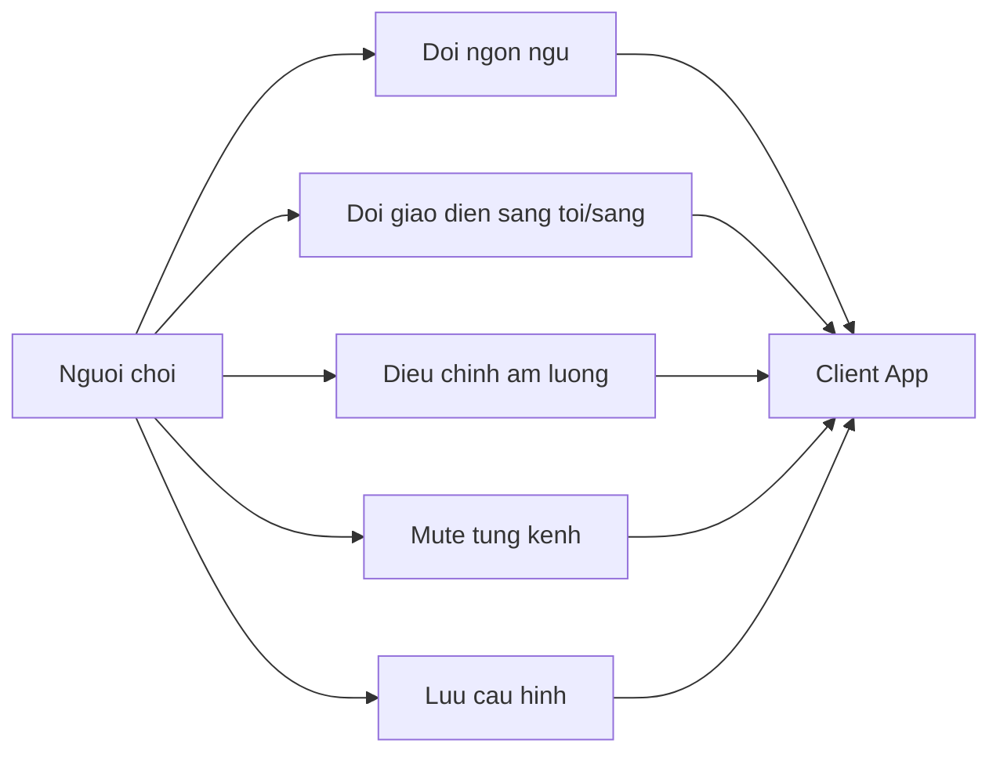

# Use Case Diagram - Settings

## Pham vi
Use case cua nguoi choi voi settings.

## Mermaid

```mermaid
flowchart LR
  U[Nguoi choi]
  APP[Client App]

  U --> UC1[Doi ngon ngu]
  U --> UC2[Doi giao dien sang toi/sang]
  U --> UC3[Dieu chinh am luong]
  U --> UC4[Mute tung kenh]
  U --> UC5[Luu cau hinh]

  UC1 --> APP
  UC2 --> APP
  UC3 --> APP
  UC4 --> APP
  UC5 --> APP
```

## Nguon ma lien quan
- client/src/components/modal/SettingsModal.tsx
- client/src/hooks/useSettings.ts
