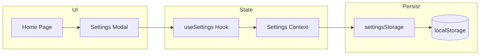

# Component Diagram - Settings

## Pham vi
Thanh phan va phu thuoc cua tinh nang settings.

## Mermaid

## Nguon ma lien quan
- client/src/pages/home.tsx
- client/src/components/modal/SettingsModal.tsx
- client/src/store/settingsContext.tsx
- client/src/services/settingsStorage.ts
