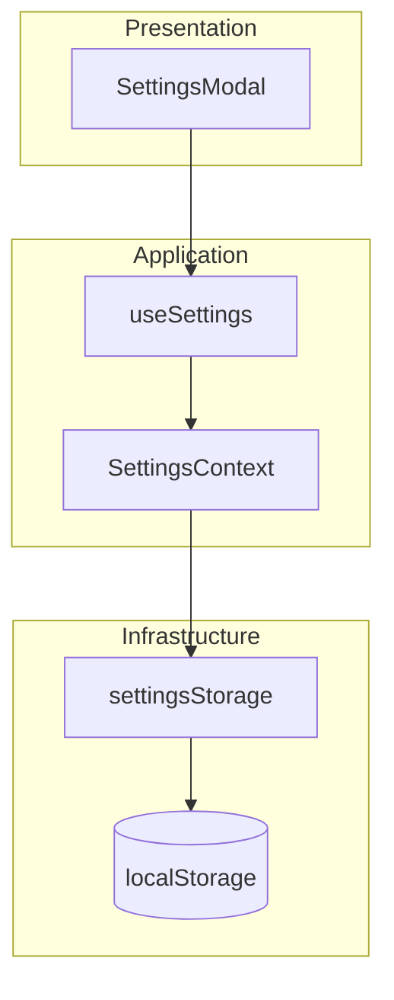

# Architecture Diagram - Settings

## Pham vi
Kien truc layer cho settings thuoc phia frontend.

## Mermaid

## Nguon ma lien quan
- client/src/components/modal/SettingsModal.tsx
- client/src/hooks/useSettings.ts
- client/src/store/settingsContext.tsx
- client/src/services/settingsStorage.ts
