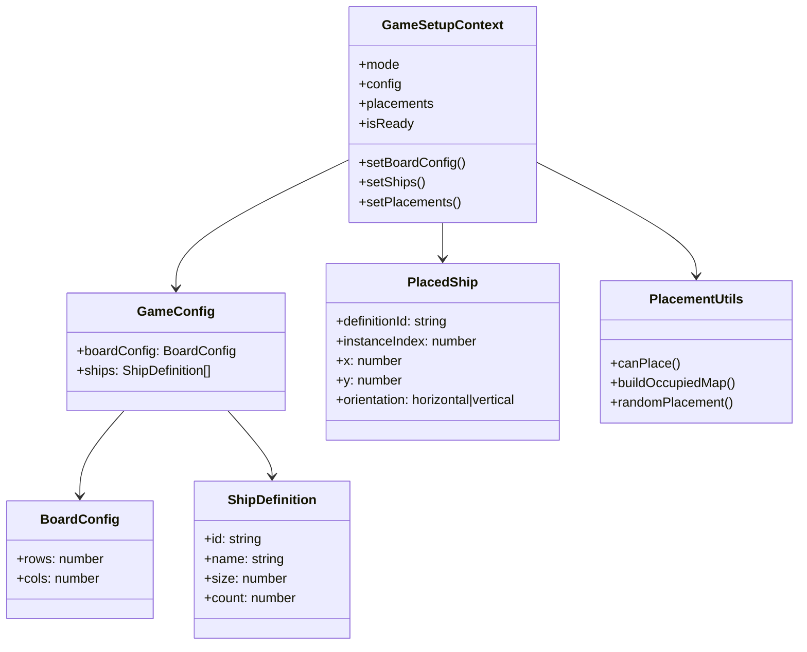

# Class Diagram - Game Setup va Placement

## Pham vi
Mo ta cac lop du lieu va quan he trong giai doan setup va dat tau.

## Mermaid

## Nguon ma lien quan
- client/src/store/gameSetupContext.tsx
- client/src/hooks/useGameSetupEngine.ts
- client/src/utils/placementUtils.ts
- client/src/types/game.ts
- client/src/constants/gameDefaults.ts
