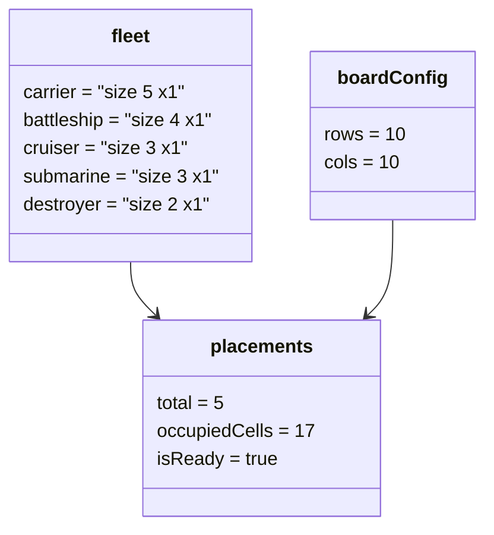

# Object Diagram - Game Setup va Placement

## Pham vi
Anh xa doi tuong mau tai thoi diem nguoi choi da dat du 5 tau tren ban 10x10.

## Mermaid

## Nguon ma lien quan
- client/src/pages/game-setup.tsx
- client/src/store/gameSetupContext.tsx
- client/src/utils/placementUtils.ts
