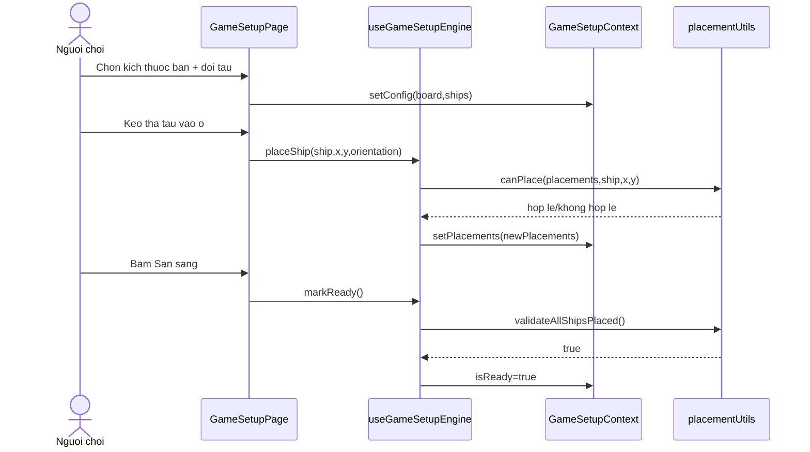

# Sequence Diagram - Dat tau

## Pham vi
Luong dat tau va xac nhan san sang trong setup.

## Mermaid

## Nguon ma lien quan
- client/src/pages/game-setup.tsx
- client/src/hooks/useGameSetupEngine.ts
- client/src/store/gameSetupContext.tsx
- client/src/utils/placementUtils.ts
