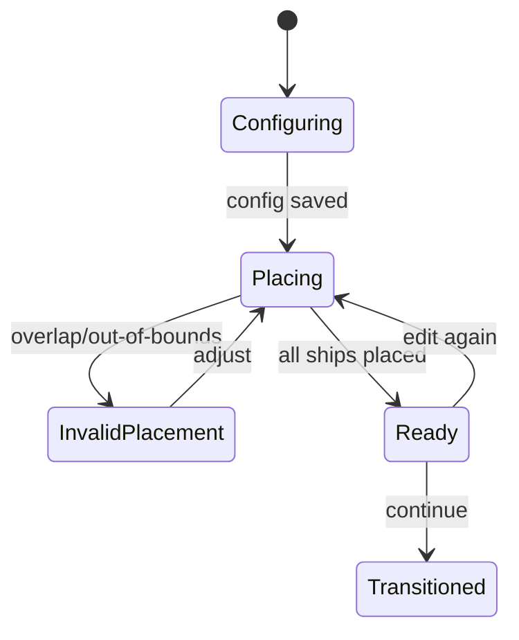

# State Diagram - Setup

## Pham vi
May trang thai cua setup mode.

## Mermaid

```mermaid
stateDiagram-v2
  [*] --> Configuring
  Configuring --> Placing: config saved
  Placing --> InvalidPlacement: overlap/out-of-bounds
  InvalidPlacement --> Placing: adjust
  Placing --> Ready: all ships placed
  Ready --> Placing: edit again
  Ready --> Transitioned: continue
```

## Nguon ma lien quan
- client/src/store/gameSetupContext.tsx
- client/src/hooks/useGameSetupEngine.ts
