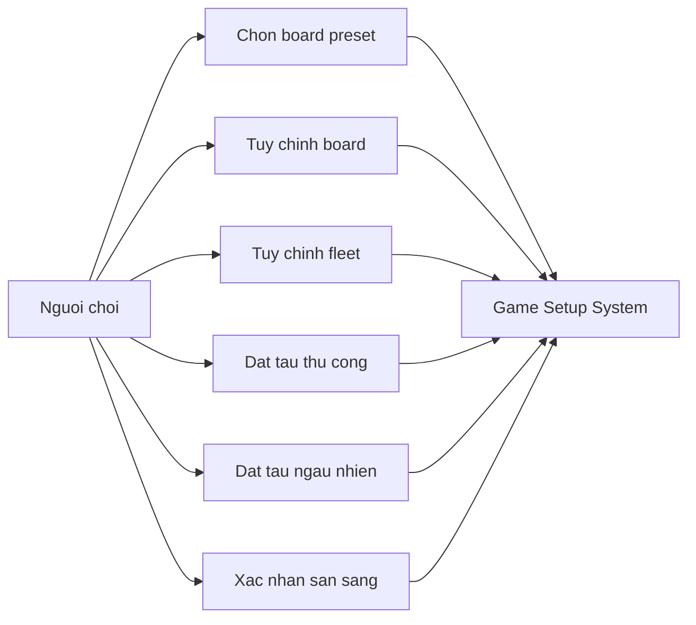

# Use Case Diagram - Setup va Placement

## Pham vi
Use case chinh cua nguoi choi trong setup.

## Mermaid

## Nguon ma lien quan
- client/src/pages/game-setup.tsx
- client/src/constants/gameDefaults.ts
- client/src/utils/placementUtils.ts
