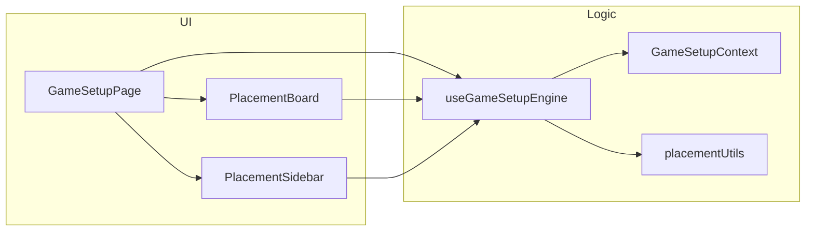

# Component Diagram - Setup va Placement

## Pham vi
Thanh phan UI, hook, store va utility cua setup.

## Mermaid

## Nguon ma lien quan
- client/src/pages/game-setup.tsx
- client/src/components/game-setup/PlacementBoard.tsx
- client/src/components/game-setup/PlacementSidebar.tsx
- client/src/hooks/useGameSetupEngine.ts
- client/src/store/gameSetupContext.tsx
