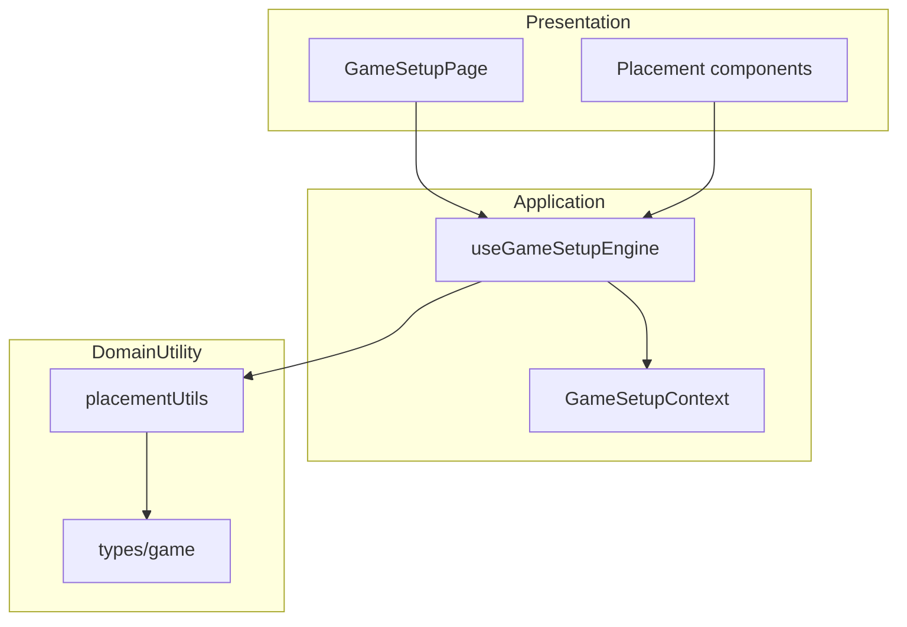

# Architecture Diagram - Setup va Placement

## Pham vi
Kien truc setup theo layer presentation -> application -> utility.

## Mermaid

## Nguon ma lien quan
- client/src/pages/game-setup.tsx
- client/src/hooks/useGameSetupEngine.ts
- client/src/store/gameSetupContext.tsx
- client/src/utils/placementUtils.ts
- client/src/types/game.ts
