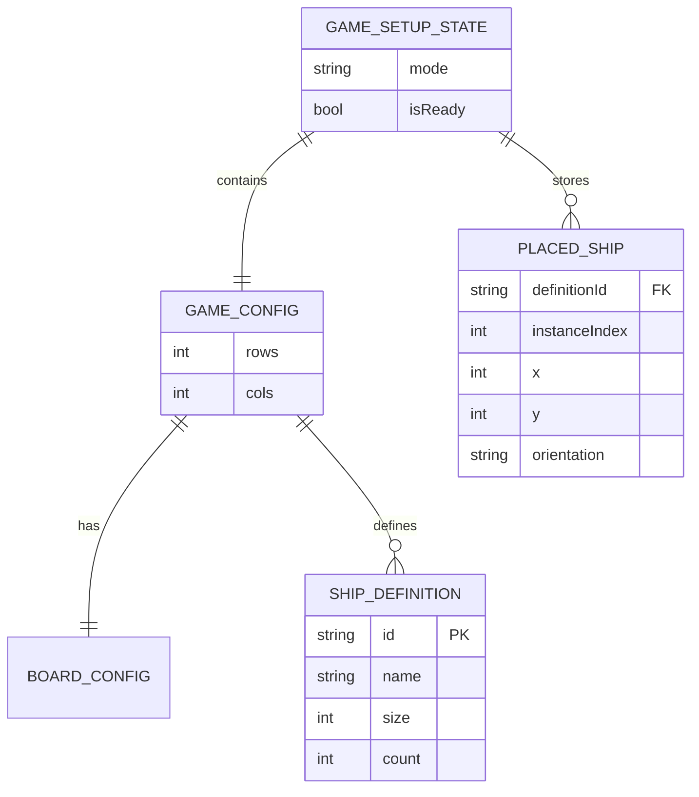

# ERD - Setup va Placement

## Pham vi
Mo hinh logic du lieu setup o phia client.

## Mermaid

## Nguon ma lien quan
- client/src/types/game.ts
- client/src/store/gameSetupContext.tsx
- client/src/constants/gameDefaults.ts
