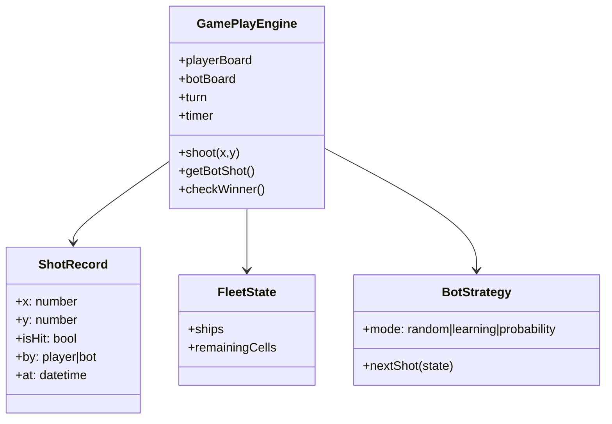

# Class Diagram - Bot Gameplay

## Pham vi
Mo ta lop du lieu va engine cho tran dau nguoi-voi-bot.

## Mermaid

## Nguon ma lien quan
- client/src/hooks/useGamePlayEngine.ts
- client/src/pages/game-play.tsx
- client/src/components/game-play/FleetPanel.tsx
- client/src/types/game.ts
