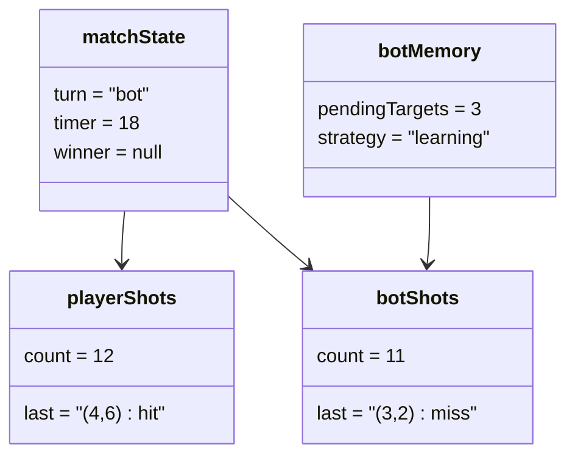

# Object Diagram - Bot Gameplay

## Pham vi
Anh xa doi tuong giua tran dau khi den luot cua bot.

## Mermaid

## Nguon ma lien quan
- client/src/hooks/useGamePlayEngine.ts
- client/src/pages/game-play.tsx
