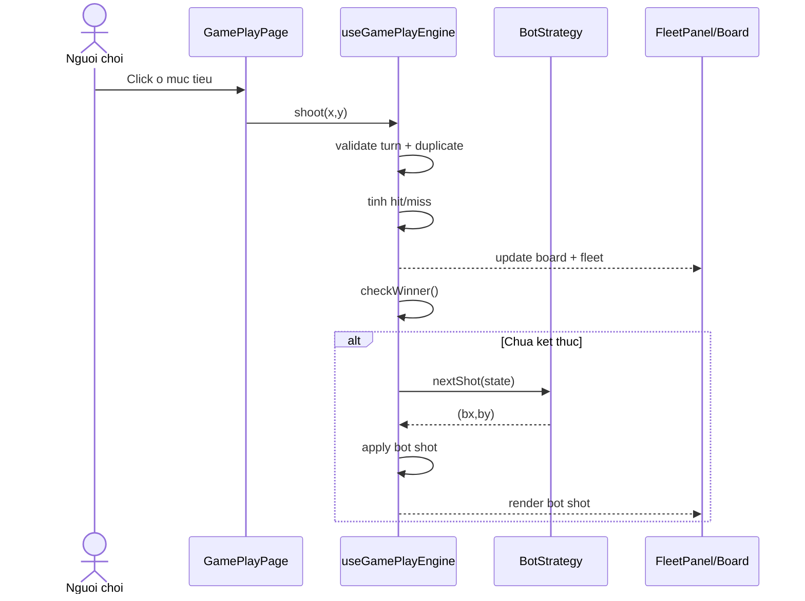

# Sequence Diagram - Luot ban voi Bot

## Pham vi
Luong thoi gian tu luot nguoi choi den luot bot va cap nhat UI.

## Mermaid

## Nguon ma lien quan
- client/src/pages/game-play.tsx
- client/src/hooks/useGamePlayEngine.ts
