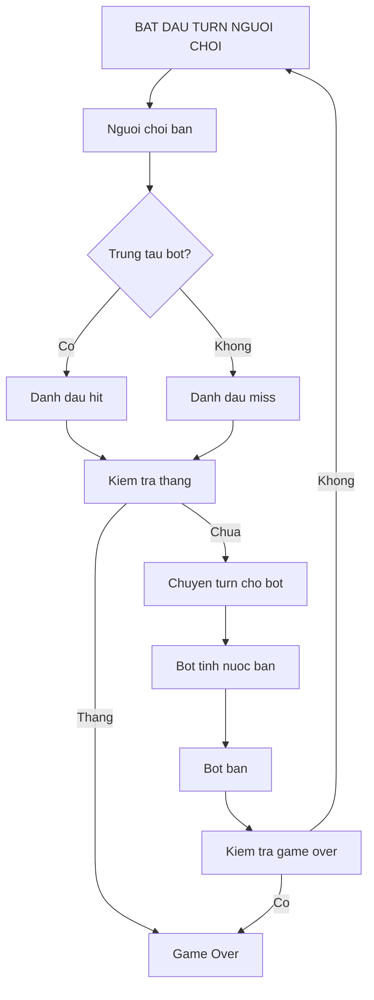

# Activity Diagram - Bot Gameplay

## Pham vi
Workflow mot vong turn trong mode bot.

## Mermaid

```mermaid
flowchart TD
  A[BAT DAU TURN NGUOI CHOI] --> B[Nguoi choi ban]
  B --> C{Trung tau bot?}
  C -->|Co| D[Danh dau hit]
  C -->|Khong| E[Danh dau miss]
  D --> F[Kiem tra thang]
  E --> F
  F -->|Thang| G[Game Over]
  F -->|Chua| H[Chuyen turn cho bot]
  H --> I[Bot tinh nuoc ban]
  I --> J[Bot ban]
  J --> K[Kiem tra game over]
  K -->|Co| G
  K -->|Khong| A
```

## Nguon ma lien quan
- client/src/hooks/useGamePlayEngine.ts
- client/src/pages/game-play.tsx
