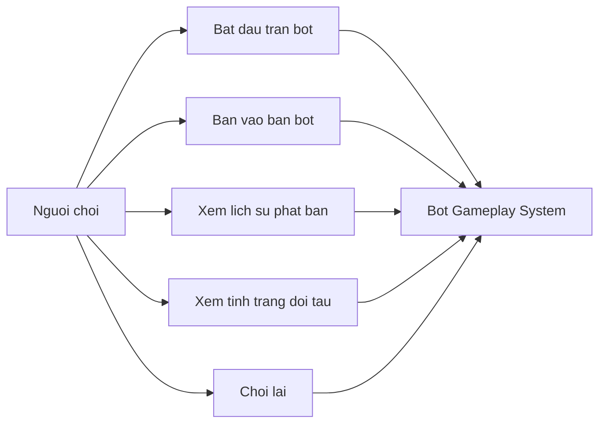

# Use Case Diagram - Bot Gameplay

## Pham vi
Use case cua nguoi choi trong mode bot.

## Mermaid

## Nguon ma lien quan
- client/src/pages/game-play.tsx
- client/src/components/game-play/FleetPanel.tsx
