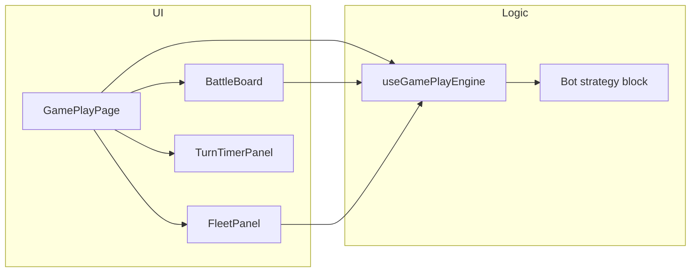

# Component Diagram - Bot Gameplay

## Pham vi
Thanh phan UI va logic cua mode bot.

## Mermaid

## Nguon ma lien quan
- client/src/pages/game-play.tsx
- client/src/components/game-play/BattleBoard.tsx
- client/src/components/game-play/FleetPanel.tsx
- client/src/components/game-play/TurnTimerPanel.tsx
- client/src/hooks/useGamePlayEngine.ts
