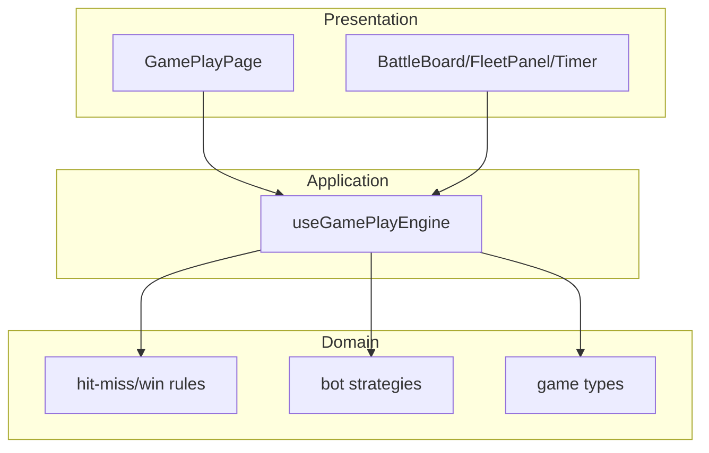

# Architecture Diagram - Bot Gameplay

## Pham vi
Kien truc theo layer cho mode bot.

## Mermaid

## Nguon ma lien quan
- client/src/pages/game-play.tsx
- client/src/hooks/useGamePlayEngine.ts
- client/src/types/game.ts
