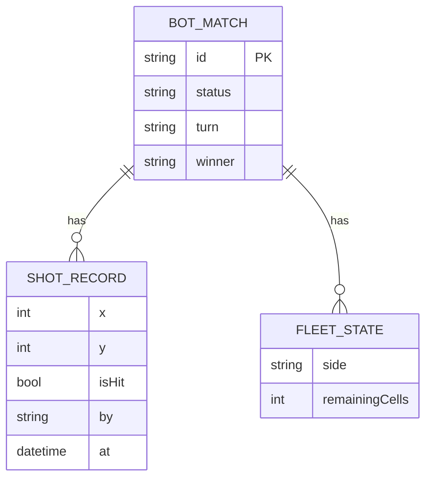

# ERD - Bot Gameplay

## Pham vi
Mo hinh logic du lieu tran dau bot tai runtime.

## Mermaid

```mermaid
erDiagram
  BOT_MATCH ||--o{ SHOT_RECORD : has
  BOT_MATCH ||--o{ FLEET_STATE : has

  BOT_MATCH {
    string id PK
    string status
    string turn
    string winner
  }
  SHOT_RECORD {
    int x
    int y
    bool isHit
    string by
    datetime at
  }
  FLEET_STATE {
    string side
    int remainingCells
  }
```

## Nguon ma lien quan
- client/src/hooks/useGamePlayEngine.ts
- client/src/types/game.ts
