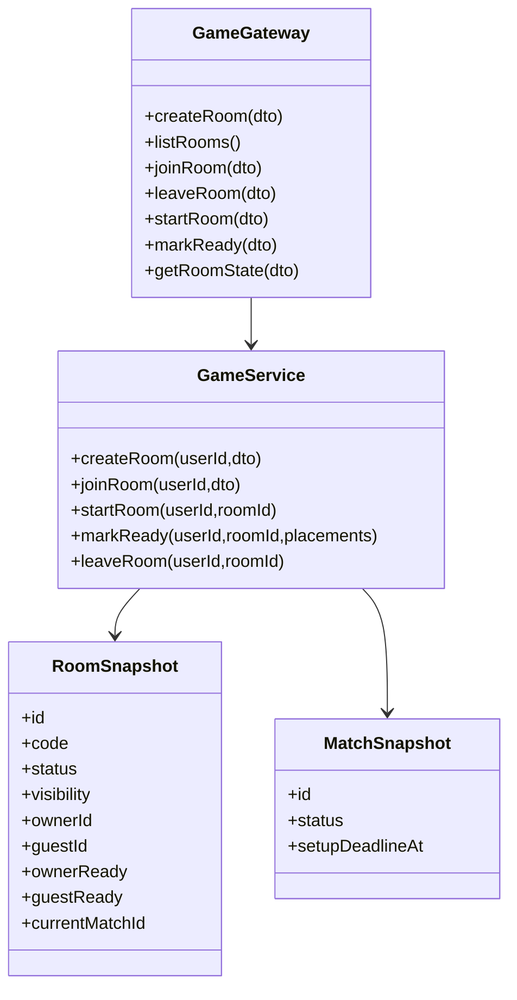

# Class Diagram - Online Room Lifecycle

## Pham vi
Mo ta lop va quan he cho vong doi phong online.

## Mermaid

## Nguon ma lien quan
- server/src/game/game.gateway.ts
- server/src/game/game.service.ts
- server/src/game/types/game.types.ts
- client/src/services/gameSocketService.ts
- client/src/hooks/useOnlineRoom.ts
- client/src/types/online.ts
