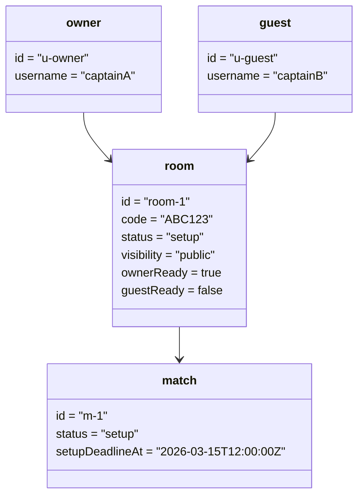

# Object Diagram - Online Room Lifecycle

## Pham vi
Anh xa doi tuong phong online khi da co du 2 nguoi truoc luc vao in_game.

## Mermaid

## Nguon ma lien quan
- server/src/game/types/game.types.ts
- client/src/types/online.ts
