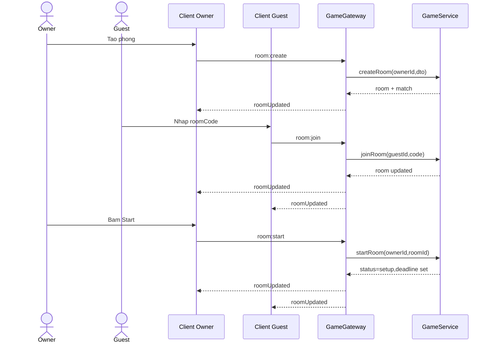

# Sequence Diagram - Tao va vao phong

## Pham vi
Luong tao phong, tham gia phong, bat dau setup.

## Mermaid

## Nguon ma lien quan
- server/src/game/game.gateway.ts
- server/src/game/game.service.ts
- client/src/pages/game-rooms.tsx
- client/src/pages/waiting-room.tsx
- client/src/services/gameSocketService.ts
