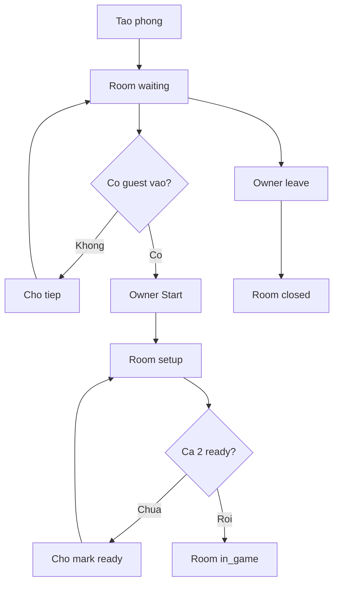

# Activity Diagram - Room Lifecycle

## Pham vi
Workflow room tu waiting den setup/in_game hoac dong phong.

## Mermaid

## Nguon ma lien quan
- server/src/game/game.service.ts
- client/src/pages/game-rooms.tsx
- client/src/pages/waiting-room.tsx
