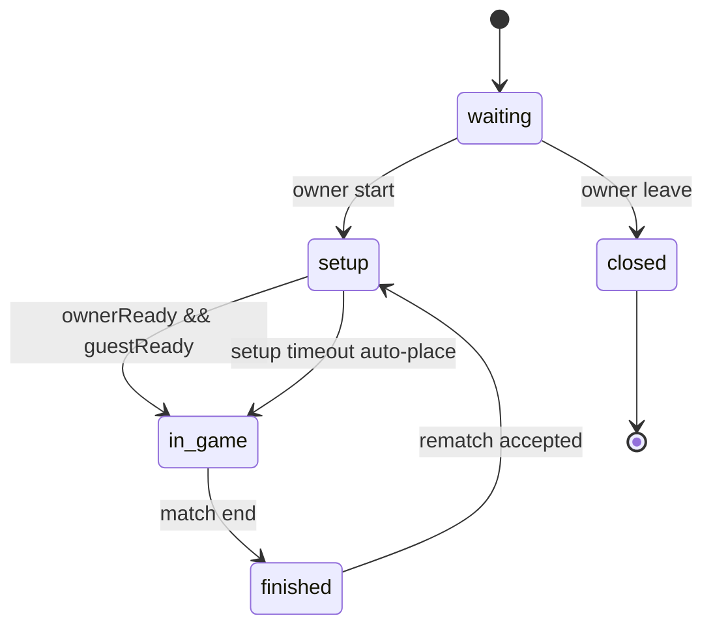

# State Diagram - Room

## Pham vi
Trang thai room.status trong online lifecycle.

## Mermaid

## Nguon ma lien quan
- server/src/game/game.service.ts
- server/src/game/infrastructure/persistence/relational/entities/room.entity.ts
