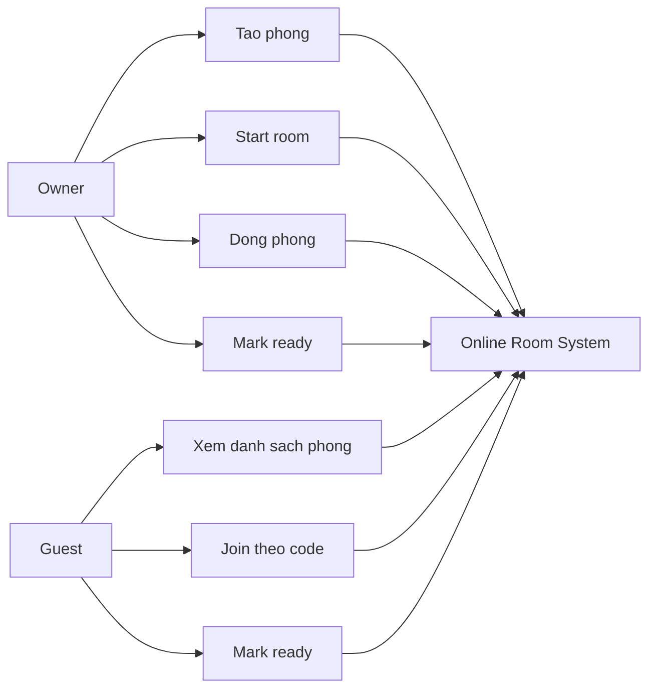

# Use Case Diagram - Room Lifecycle

## Pham vi
Use case cua Owner va Guest voi phong online.

## Mermaid

## Nguon ma lien quan
- client/src/pages/game-rooms.tsx
- client/src/pages/waiting-room.tsx
- server/src/game/game.gateway.ts
