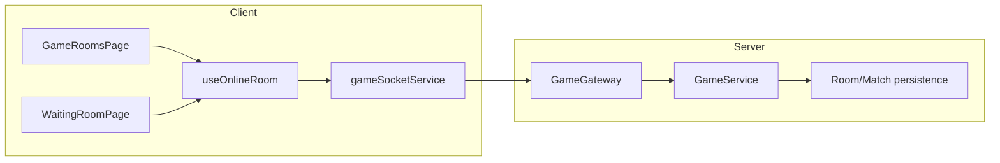

# Component Diagram - Room Lifecycle

## Pham vi
Thanh phan client-server tham gia quan ly phong online.

## Mermaid

## Nguon ma lien quan
- client/src/pages/game-rooms.tsx
- client/src/pages/waiting-room.tsx
- client/src/hooks/useOnlineRoom.ts
- client/src/services/gameSocketService.ts
- server/src/game/game.gateway.ts
- server/src/game/game.service.ts
