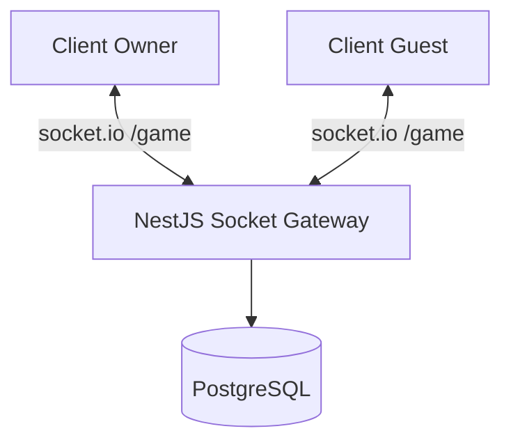

# Deployment Diagram - Room Lifecycle

## Pham vi
Topologi runtime cho room realtime.

## Mermaid

## Nguon ma lien quan
- server/src/game/game.gateway.ts
- server/src/game/game.service.ts
- docker-compose.yml
