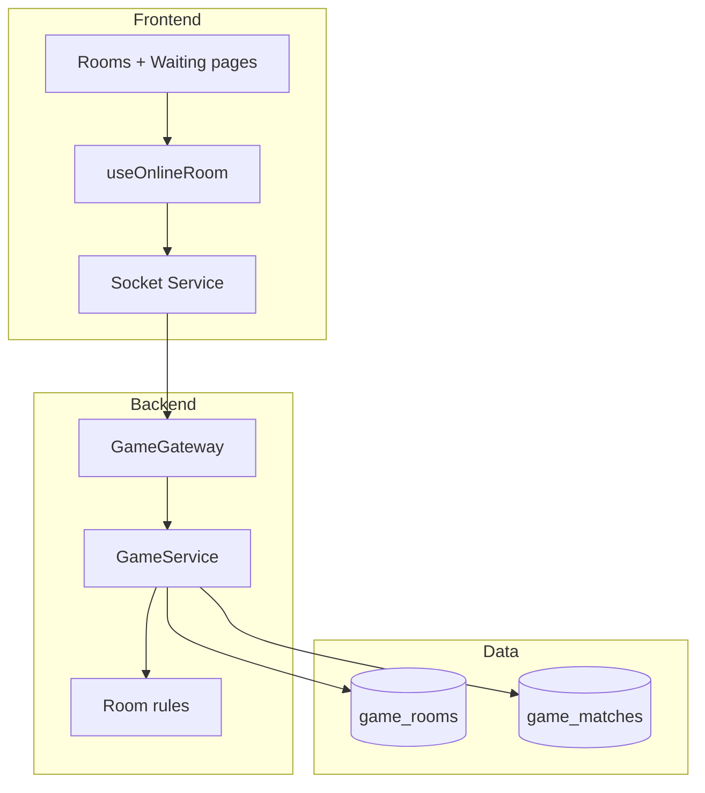

# Architecture Diagram - Room Lifecycle

## Pham vi
Kien truc luong room online theo layer.

## Mermaid

## Nguon ma lien quan
- client/src/hooks/useOnlineRoom.ts
- client/src/services/gameSocketService.ts
- server/src/game/game.gateway.ts
- server/src/game/game.service.ts
