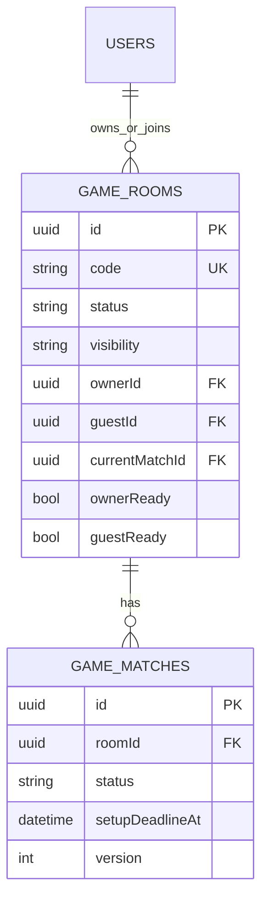

# ERD - Room Lifecycle

## Pham vi
Quan he du lieu room va match cho vong doi phong.

## Mermaid

## Nguon ma lien quan
- server/src/game/infrastructure/persistence/relational/entities/room.entity.ts
- server/src/game/infrastructure/persistence/relational/entities/match.entity.ts
- server/src/database/migrations/1773446400001-InitGameTables.ts
- server/src/database/migrations/1773446400002-AddSetupDeadlineToMatches.ts
