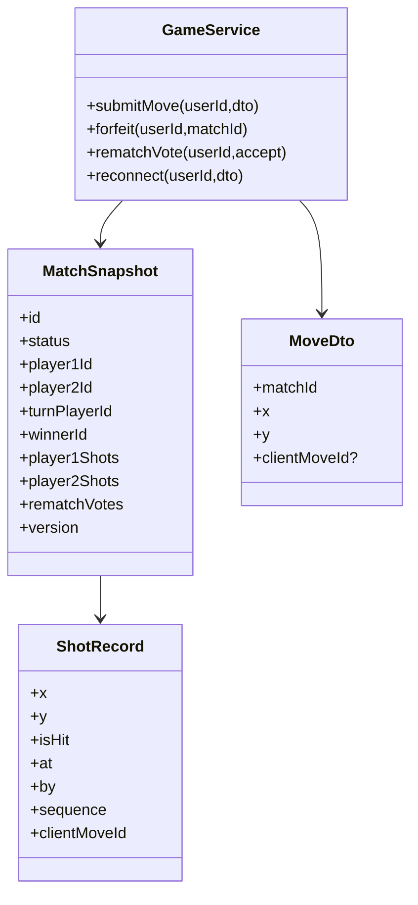

# Class Diagram - Online Match Lifecycle

## Pham vi
Mo ta lop va quan he cho tran dau online theo luot.

## Mermaid

## Nguon ma lien quan
- server/src/game/game.service.ts
- server/src/game/dto/game-events.dto.ts
- server/src/game/types/game.types.ts
- client/src/types/online.ts
- client/src/services/gameSocketService.ts
