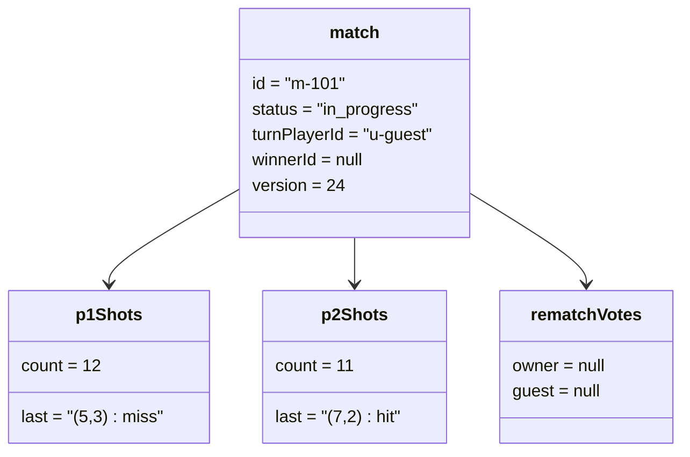

# Object Diagram - Online Match Lifecycle

## Pham vi
Anh xa doi tuong tai thoi diem giua tran dau online.

## Mermaid

## Nguon ma lien quan
- server/src/game/types/game.types.ts
- client/src/types/online.ts
