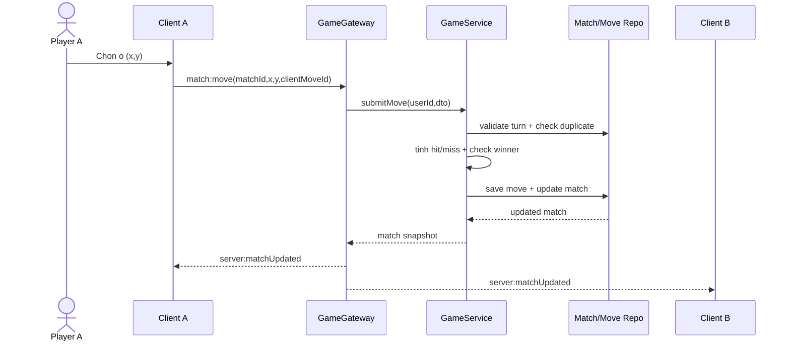

# Sequence Diagram - Move va Broadcast

## Pham vi
Luong gui nuoc ban, xu ly server va dong bo 2 client.

## Mermaid

## Nguon ma lien quan
- server/src/game/game.gateway.ts
- server/src/game/game.service.ts
- client/src/services/gameSocketService.ts
- client/src/hooks/useOnlineRoom.ts
